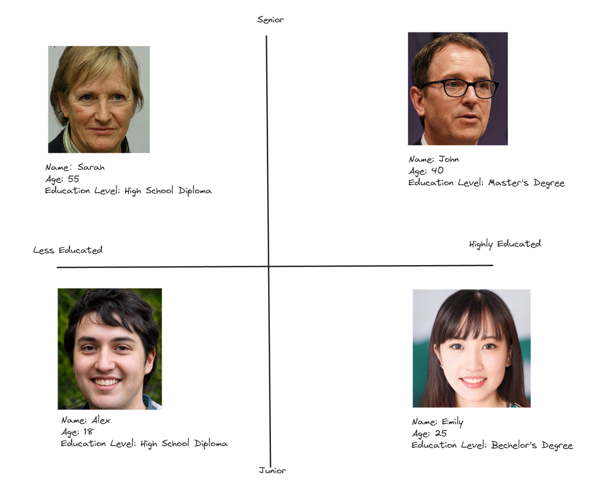
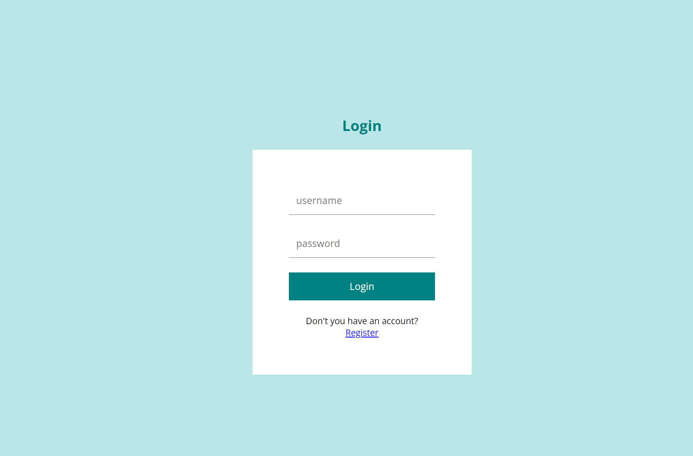
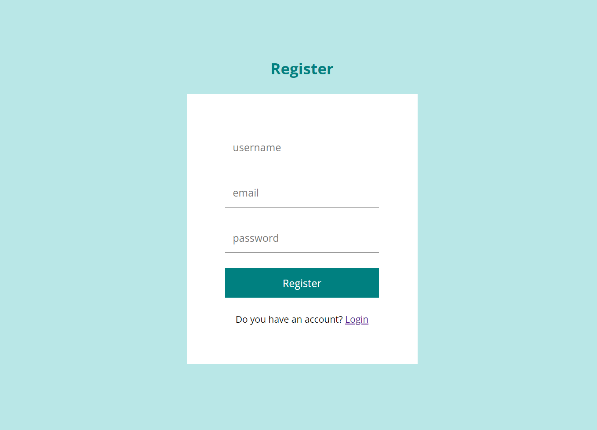
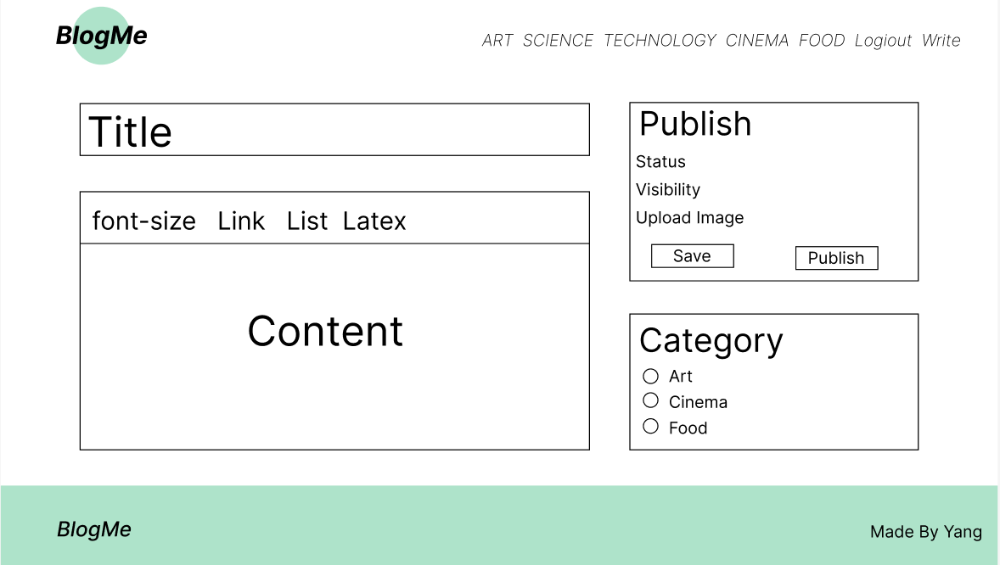
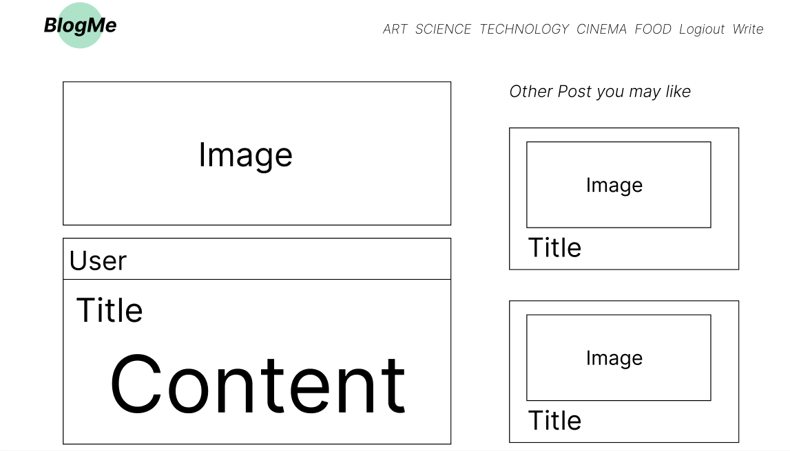

# BlogMe

## 1. Business Requirement

### 1.1 Description

BlogMe is a dynamic and user-centric blog system designed to facilitate seamless content creation, sharing, and interaction among individuals with diverse interests and passions. Tailored to meet the needs of bloggers, content creators, and avid readers alike, BlogMe offers a comprehensive platform where users can explore, engage, and connect through the power of written word and visual storytelling.

### 1.2 Key Features

User-Friendly Interface: BlogMe boasts a sleek and intuitive interface, making it easy for users to navigate, create, and manage their own blogs with minimal effort.

Rich Text Editor: Our integrated rich text editor empowers users to craft compelling blog posts with ease. From formatting text to embedding images, videos, and multimedia content, the editor offers a seamless content creation experience.

Image Insertion: Users can enhance their blog posts by seamlessly inserting images and multimedia elements, enriching their storytelling and engaging readers on a visual level.

User Authentication: To ensure a secure and personalized experience, BlogMe features robust user authentication mechanisms, allowing individuals to register, log in, and manage their accounts securely.

Customization and Personalization: Users have the flexibility to customize their blog layouts, categories, and settings to reflect their unique style and personality, ensuring a personalized blogging experience.

Content Moderation: With built-in content moderation tools, administrators can oversee user-generated content, ensuring compliance with community guidelines and fostering a safe and inclusive environment for all users.

### 1.3 Target Audience

The target audience includes bloggers, content creators, and readers who are interested in sharing and consuming written and visual content on various topics.

### 1.4 Nouns and Verbs

#### **Nouns**

Rich Text Editor

Image

User

Account

Community

Content

Setting

Administrator

Blog

Writer

Reader

Creator

Domain

Categories

Post

#### Verbs

Navigate

Enhance

Insert

Register

Log In

Manage

Customize

Personalize

Moderate

Connect

Join

Embark

Create

Edit

Delete

### 1.5 Aggregation

#### **User**

**Properties**

Username

Email

Password

Image

**Methods**

register()

logIn()

manageAccount()

#### **Post**

**Properties**

title

content

author

date

**Methods**

createPost()

editPost()

deletePost()

insertImage()

#### **Image**

**Properties**

URL

caption

#### **Administrator**

**Properties**

Username

Email

Password

Image

**Methods**

moderateContent()

#### **Category**

**Properties**

CategoryName

**Methods**

createCategory()

addCategoryToPost()

### 1.6 Rules

Users must register and log in to create and manage their blog posts.
Users should adhere to community guidelines and refrain from posting inappropriate or offensive content.
Administrators have the authority to manage user accounts and moderate content to ensure a safe and positive user experience.

#### Challenge Questions

How can we ensure user authentication and data security?
What features can enhance user engagement and interaction within the blog community?
How can we optimize the rich text editor for seamless content creation and image insertion?

### 1.7 User Stories

#### All the possible Dimension

Age: Categorizing users based on their age range.

Gender: Classifying users based on their gender identity.

Occupation: Grouping users based on their profession or occupation.

Interests: Segmenting users based on their hobbies, interests, and preferences.

Location: Classifying users based on their geographic location or region.

Income Level: Categorizing user  based on their income bracket.

Education Level: Grouping users based on their educational attainment.

Technological Proficiency: Segmenting users based on their familiarity and proficiency with technology.

Social Activity: Categorizing users based on their level of social engagement and activity.

#### Two most important dimension

Age and Education Level

##### Dimension Table

#### User Persona and User Story

##### **User Persona: Emily**

**Background:** Emily is a 25-year-old marketing professional with a Bachelor's degree. She enjoys traveling, photography, and exploring new cultures.

**User Story:**

As Emily, I want to share my travel experiences and photos with others on the blog platform.

As Emily, I want to connect with fellow travelers and exchange tips and recommendations for future trips.

As Emily, I want to discover new destinations and get inspired by the travel stories of other users.

As Emily, I want to receive feedback and comments on my travel blog posts to improve and refine my content.

##### **User Persona: John**

**Background:** John is a 40-year-old finance professional with a Master's degree. He is passionate about investments, financial planning, and wealth management.

**User Story:**

As John, I want to share insights and analysis on financial markets and investment strategies through blog posts.

As John, I want to engage in discussions with other finance professionals and investors to exchange ideas and perspectives.

As John, I want to stay updated on the latest trends and developments in the financial industry through curated content and expert opinions.

As John, I want to contribute valuable content that educates and informs other users about personal finance and investment opportunities.

##### **User Persona: Sarah**

**Background:** Sarah is a 55-year-old retiree with a high school diploma. She enjoys gardening, cooking, and spending time with her family.

**User Story:**

As Sarah, I want to share my gardening tips and recipes for home-cooked meals with like-minded individuals on the blog platform.

As Sarah, I want to connect with other gardening enthusiasts and exchange ideas for plant care and landscaping.

As Sarah, I want to discover new recipes and cooking techniques from fellow users to expand my culinary skills.

As Sarah, I want to showcase my gardening projects and culinary creations to inspire others and foster a sense of community.

##### **User Persona: Alex**

**Background:** Alex is an 18-year-old high school student in his senior year. He is passionate about gaming, technology, and programming.

**User Story:**

As Alex, I want to share my gaming experiences, reviews, and insights on the latest video game releases with fellow gamers.

As Alex, I want to connect with other gamers and participate in online discussions, tournaments, and gaming events.

As Alex, I want to explore new technologies and programming languages through tutorials, guides, and community resources.

As Alex, I want to contribute to the gaming and technology community by sharing my knowledge and expertise with others.

## 2 Low level mockups

### 2.1 Login

### 2.2 Register

### 2.3 Create Post 

### 2.4 Read Post

## 3 UML Class Diagram

 
